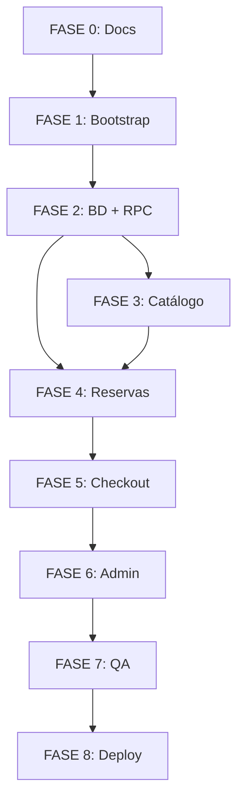

# Arquitectura — Láminas 2026

> **Estado:** FASE 0  
> **Última actualización:** 2026-07-17

---

## 1. Visión general

Aplicación web monolítica **Next.js (App Router)** con backend en **Supabase PostgreSQL**. El frontend se despliega en **Cloudflare Pages**; la lógica crítica de inventario vive en **funciones PostgreSQL transaccionales**, no en el cliente.

```
┌─────────────────────────────────────────────────────────────────┐
│                     Cloudflare Pages                            │
│  ┌───────────────────────────────────────────────────────────┐  │
│  │              Next.js 15 (App Router)                      │  │
│  │  ┌─────────────┐  ┌──────────────┐  ┌─────────────────┐ │  │
│  │  │   Pages     │  │ Server       │  │  Route Handlers │ │  │
│  │  │  (RSC/CSR)  │  │ Actions      │  │  (webhooks)     │ │  │
│  │  └──────┬──────┘  └──────┬───────┘  └────────┬────────┘ │  │
│  └─────────┼────────────────┼───────────────────┼────────────┘  │
└────────────┼────────────────┼───────────────────┼───────────────┘
             │                │                   │
             ▼                ▼                   ▼
┌─────────────────────────────────────────────────────────────────┐
│                         Supabase                                │
│  ┌──────────┐  ┌──────────────┐  ┌──────────┐  ┌─────────────┐ │
│  │   Auth   │  │  PostgreSQL  │  │ Realtime │  │   Storage   │ │
│  │ (admin)  │  │  + RLS + RPC │  │          │  │ (comprob.)  │ │
│  └──────────┘  └──────────────┘  └──────────┘  └─────────────┘ │
└─────────────────────────────────────────────────────────────────┘
```

---

## 2. Principios arquitectónicos

1. **Fuente de verdad en PostgreSQL** — stock, reservas y precios viven en BD.
2. **Operaciones críticas en RPC** — reserva, expiración, confirmación de pago.
3. **Cliente anónimo sin privilegios** — solo lectura pública y acciones acotadas vía Server Actions.
4. **Service role nunca en cliente** — solo en entorno servidor (Edge/Node según compatibilidad).
5. **Configuración en BD** — reglas de negocio editables sin redeploy.
6. **Mobile-first, accesible** — Tailwind + shadcn/ui; WCAG AA.
7. **Evitar sobre-ingeniería** — un repositorio, sin microservicios.

---

## 3. Stack tecnológico

| Capa | Tecnología |
|------|------------|
| Framework | Next.js estable, App Router, TypeScript estricto |
| Estilos | Tailwind CSS, shadcn/ui |
| BD | Supabase PostgreSQL |
| Auth | Supabase Auth (solo administradores) |
| Realtime | Supabase Realtime (cambios inventario/reservas) |
| Storage | Supabase Storage (comprobantes, bucket privado) |
| Formularios | React Hook Form + Zod |
| Tests | Vitest, Testing Library, Playwright |
| Lint/format | ESLint, Prettier |
| Package manager | pnpm |
| Deploy frontend | Cloudflare Pages (`@cloudflare/next-on-pages` o equivalente estable) |
| Migraciones | SQL versionadas en `supabase/migrations/` |

---

## 4. Estructura de directorios propuesta

```
figuritasMundial/
├── .env.example
├── README.md
├── docs/                          # Documentación
├── supabase/
│   ├── config.toml
│   ├── migrations/                # SQL versionado
│   ├── seed.sql
│   └── tests/                     # Pruebas SQL (pgTAP o scripts)
├── public/
│   ├── og-image.png               # Placeholder social
│   └── ...
├── src/
│   ├── app/
│   │   ├── layout.tsx
│   │   ├── page.tsx               # Landing
│   │   ├── elegir/
│   │   │   └── page.tsx           # Selector
│   │   ├── reserva/
│   │   │   └── [token]/page.tsx   # Página pública pedido
│   │   ├── checkout/
│   │   │   └── page.tsx
│   │   ├── compartir/
│   │   │   └── page.tsx
│   │   ├── (legal)/
│   │   │   ├── terminos/page.tsx
│   │   │   ├── privacidad/page.tsx
│   │   │   ├── reservas/page.tsx
│   │   │   └── retiro-despacho/page.tsx
│   │   ├── admin/
│   │   │   ├── layout.tsx         # Auth guard
│   │   │   ├── page.tsx           # Dashboard
│   │   │   ├── inventario/
│   │   │   ├── pedidos/
│   │   │   ├── configuracion/
│   │   │   └── ...
│   │   ├── api/
│   │   │   ├── health/route.ts
│   │   │   └── cron/
│   │   │       └── expire-reservations/route.ts
│   │   ├── sitemap.ts
│   │   └── robots.ts
│   ├── components/
│   │   ├── ui/                    # shadcn
│   │   ├── catalog/               # Selector, sticker button
│   │   ├── cart/                  # Resumen sticky
│   │   ├── checkout/
│   │   ├── admin/
│   │   └── shared/
│   ├── lib/
│   │   ├── supabase/
│   │   │   ├── client.ts          # Browser (anon key)
│   │   │   ├── server.ts          # Server (cookies)
│   │   │   └── admin.ts           # Service role (solo server)
│   │   ├── pricing/               # Cálculo desde reglas BD
│   │   ├── reservations/
│   │   ├── payments/
│   │   │   └── providers/
│   │   │       ├── types.ts       # PaymentProvider interface
│   │   │       └── bank-transfer.ts
│   │   ├── cart/
│   │   ├── validation/            # Esquemas Zod compartidos
│   │   ├── security/
│   │   │   ├── rate-limit.ts
│   │   │   └── tokens.ts
│   │   └── utils/
│   ├── hooks/
│   ├── actions/                   # Server Actions
│   │   ├── reservations.ts
│   │   ├── checkout.ts
│   │   ├── cart.ts
│   │   └── admin/
│   └── types/
├── tests/
│   ├── unit/
│   ├── integration/
│   └── e2e/                       # Playwright
├── vitest.config.ts
├── playwright.config.ts
├── next.config.ts
├── tailwind.config.ts
├── tsconfig.json
├── eslint.config.mjs
├── prettier.config.mjs
└── package.json
```

---

## 5. Capas de la aplicación

### 5.1 Presentación (React)

- **Server Components** para datos iniciales de catálogo (SEO, performance).
- **Client Components** para interactividad del selector, carrito, countdown.
- Estado local del carrito sincronizado con `anonymous_carts` vía Server Actions.

### 5.2 Lógica de aplicación (Server Actions / Route Handlers)

| Operación | Mecanismo |
|-----------|-----------|
| Crear reserva | Server Action → RPC `create_reservation` |
| Completar checkout | Server Action → RPC `convert_to_order` |
| Reportar pago | Server Action → insert + Storage upload |
| Admin: confirmar pago | Server Action → RPC `confirm_payment` |
| Expirar reservas | Route Handler cron + RPC `expire_reservations` |
| Leer catálogo | Server Component + Supabase anon client |
| Realtime subscribe | Client + anon key (canal filtrado) |

### 5.3 Dominio (PostgreSQL)

- Constraints, checks, triggers ligeros
- Funciones RPC transaccionales
- Vistas materializadas opcionales para dashboard (evaluar en FASE 2)

---

## 6. Flujos de datos principales

### 6.1 Selección (sin reserva)

```
Usuario → Client Component → localStorage (cart_id)
                         → Server Action sync anonymous_cart (opcional, debounced)
                         → Lectura inventario disponible (vista/RPC)
```

El carrito **no decrementa stock**.

### 6.2 Reserva atómica

```
Usuario confirma → Server Action
  → Rate limit check
  → Zod validation
  → supabase.rpc('create_reservation', { items, cart_id, ... })
      → BEGIN
      → expire_reservations() (idempotente)
      → SELECT ... FOR UPDATE en inventory
      → Verificar stock
      → INSERT reservation + items
      → UPDATE inventory.reserved_qty
      → COMMIT
  ← { public_code, expires_at, token } | { error, sold_out_codes }
```

### 6.3 Realtime

Canal: cambios en `inventory` y `reservations` (status/expiry).

Cliente invalida cache local / actualiza estado de botones.

### 6.4 Página pública de pedido

URL: `/reserva/[token]` donde `token` es hash criptográfico almacenado, no el UUID interno.

---

## 7. Autenticación y autorización

| Actor | Mecanismo | Permisos |
|-------|-----------|----------|
| Visitante | Anon key + RLS | Leer catálogo; crear reserva propia; ver pedido con token |
| Admin | Supabase Auth (email/password o magic link) | CRUD vía RLS policies + Server Actions con verificación de rol |
| Cron | Secret header (`CRON_SECRET`) | Invocar expiración |
| Service role | Solo servidor | Bypass RLS en operaciones batch admin si necesario |

**Admin profiles:** tabla `admin_profiles` vinculada a `auth.users` con rol.

---

## 8. Row Level Security (estrategia)

| Tabla | Público (anon) | Admin |
|-------|----------------|-------|
| `stickers`, `sections`, `collections` | SELECT activos | ALL |
| `inventory` | SELECT campos públicos (available_qty calculado) | ALL |
| `pricing_rules`, `shipping_rules`, `settings` | SELECT reglas activas | ALL |
| `anonymous_carts` | INSERT/UPDATE/SELECT propio (por cart_token) | ALL |
| `reservations`, `orders` | SELECT propio (por access_token hash) | ALL |
| `payments`, `payment_proofs` | INSERT propio; SELECT propio limitado | ALL |
| `inventory_movements`, `audit_logs` | — | SELECT |
| `admin_profiles` | — | SELECT propio |

Las políticas exactas se documentan en `docs/DATABASE.md` (FASE 2).

---

## 9. Cálculo de precios

```
┌─────────────────┐     ┌──────────────────┐
│ pricing_rules   │────▶│ pricing.service  │
│ (BD, versionada)│     │ (TypeScript)     │
└─────────────────┘     └────────┬─────────┘
                                 │
                    ┌────────────▼────────────┐
                    │ calculateOrderTotal(qty)│
                    │ - tramos lineales       │
                    │ - promos exactas (50,75)│
                    │ - ahorro vs tramo base  │
                    └─────────────────────────┘
```

- Reglas cargadas desde BD en servidor.
- Misma lógica en RPC para validar total al crear reserva (defensa en profundidad).
- Tests unitarios duplican casos de negocio documentados.

---

## 10. Integración Cloudflare Pages

### Consideraciones

- Next.js en Cloudflare requiere adaptador (`@cloudflare/next-on-pages` o `@opennextjs/cloudflare` según versión estable al momento de FASE 1).
- Server Actions y Route Handlers deben ser compatibles con Edge/Node runtime elegido.
- Variables de entorno en Cloudflare dashboard (no commitear secrets).
- Supabase URL y anon key: públicas (prefijo `NEXT_PUBLIC_`).
- Service role, cron secret, rate limit salt: solo servidor.

### Build

```bash
pnpm build
# adaptador genera output compatible Cloudflare
```

---

## 11. Observabilidad

| Aspecto | Enfoque MVP |
|---------|-------------|
| Logs | Console estructurado en server; sin PII completa |
| Errores | Boundaries en React; códigos de error estructurados desde RPC |
| Métricas | Supabase dashboard + logs Cloudflare |
| Auditoría | Tabla `audit_logs` para acciones admin |

---

## 12. Seguridad (resumen)

Ver `docs/SECURITY.md` (FASE 1+). Puntos clave:

- CSP y headers vía `next.config.ts` / middleware
- Rate limiting en memoria (MVP) o KV de Cloudflare (FASE 8)
- CSRF: Next.js Server Actions con origin check nativo
- Upload: tipos MIME whitelist, tamaño máximo, scan manual admin
- Tokens: `crypto.randomBytes` para cart_id y order access tokens

---

## 13. Testing strategy

| Tipo | Herramienta | Alcance |
|------|-------------|---------|
| Unitario | Vitest | Pricing, shipping, tokens, mensajes |
| Integración | Vitest + Supabase local | RPC reserva, expiración |
| Concurrencia | Script SQL / Vitest paralelo | Última unidad |
| E2E | Playwright | Flujos completos |
| Accesibilidad | axe en Playwright / manual | WCAG AA |

---

## 14. Dependencias entre fases



---

## 15. Decisiones diferidas

| Tema | Cuándo decidir |
|------|----------------|
| Adaptador exacto Cloudflare | FASE 1 (según versión Next.js estable) |
| pgTAP vs scripts SQL custom | FASE 2 |
| Rate limit: memoria vs Cloudflare KV | FASE 4/8 |
| Nombre final de marca | Antes de FASE 3 (no bloqueante) |
